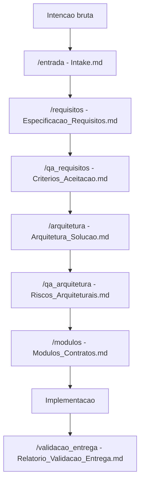

# .github
# SDLC AI-Native / V-Bounce

> Um framework prático para transformar intenção em solução — sem pular direto para o código e depois fingir surpresa quando tudo vira refatoração arqueológica.

## Visão geral

O **SDLC AI-Native / V-Bounce** é um framework de trabalho para construção de soluções de software com apoio de IA, estruturado em fases progressivas, gates de qualidade e artefatos formais.

A ideia central é simples:

1. capturar a intenção;
2. transformar em requisitos claros;
3. validar aceitação;
4. propor arquitetura;
5. decompor em módulos;
6. validar a entrega contra o que foi combinado.

Em vez de usar IA apenas como “gerador de código”, este projeto usa IA como parceira de engenharia ao longo do ciclo de vida da solução.

## Por que este projeto existe

Muitos projetos falham não porque o código é ruim, mas porque:

- a intenção inicial era vaga;
- os requisitos não eram testáveis;
- a arquitetura nasceu tarde demais;
- o handoff entre fases perdeu contexto;
- a implementação correu mais rápido que o entendimento.

Este framework tenta resolver isso com uma abordagem mais disciplinada, porém prática: cada etapa produz artefatos objetivos e só avança quando passa por um gate explícito.

## Como funciona

O fluxo é organizado por agentes especializados:

| Fase | Agente | Artefato principal |
|---|---|---|
| Entrada | `/entrada` | `Intake.md` |
| Requisitos | `/requisitos` | `Especificacao_Requisitos.md` |
| Validação de requisitos | `/qa_requisitos` | `Criterios_Aceitacao.md` |
| Arquitetura | `/arquitetura` | `Arquitetura_Solucao.md` |
| Crítica arquitetural | `/qa_arquitetura` | `Riscos_Arquiteturais.md` |
| Modularização | `/modulos` | `Modulos_Contratos.md` |
| Validação final | `/validacao_entrega` | `Relatorio_Validacao_Entrega.md` |

Cada agente tem uma responsabilidade dominante. A regra é:

> Um chat, um papel, um artefato bem formado.

## Princípios

- Clareza antes de implementação.
- Requisitos precisam ser verificáveis.
- Arquitetura deve responder a requisitos reais, não a modismos.
- Toda decisão importante deve deixar rastro.
- Toda fase deve declarar ambiguidades, premissas, riscos e pendências.
- Nenhuma etapa desce para a próxima sem gate explícito.
- Diagramas são usados como ferramenta semântica, não decoração de PowerPoint.
- IA ajuda a estruturar, desafiar e refinar — mas o julgamento humano continua no volante.

## Pipeline de construção

## Gates de qualidade

Cada transição possui critérios mínimos de descida:

- **G0 — Entrada para Requisitos**  
  A intenção precisa estar clara o suficiente para elicitação.

- **G1 — Requisitos para Arquitetura**  
  Os requisitos principais precisam estar claros, consistentes e testáveis.

- **G2 — Arquitetura para Modularização**  
  A arquitetura precisa cobrir os requisitos, componentes, integrações, riscos e trade-offs.

- **G3 — Modularização para Implementação**  
  Os módulos precisam ter responsabilidades, interfaces e dependências explícitas.

- **G4 — Entrega para Aceite**  
  A entrega precisa aderir aos requisitos, critérios de aceitação, arquitetura e módulos aprovados.

## Artefatos gerados

O projeto trabalha com artefatos Markdown e, quando útil, formatos complementares como Mermaid, YAML ou JSON.

Exemplos:

- `Intake.md`
- `Especificacao_Requisitos.md`
- `Criterios_Aceitacao.md`
- `Arquitetura_Solucao.md`
- `Riscos_Arquiteturais.md`
- `Modulos_Contratos.md`
- `Relatorio_Validacao_Entrega.md`
- diagramas `.mmd`
- contratos `.yaml`
- checklists de validação

## Diferencial

Este não é apenas um repositório de prompts.

É uma tentativa de organizar um **modo de trabalho AI-native**, onde cada conversa com IA gera um artefato útil, rastreável e reutilizável.

O foco está no upstream do SDLC:

- entendimento;
- refinamento;
- validação;
- arquitetura;
- decomposição;
- rastreabilidade.

Código vem depois. Porque código sem entendimento é só dívida técnica com autocomplete.

## Para quem é

Este projeto pode ser útil para:

- product owners;
- tech leads;
- arquitetos de software;
- analistas de requisitos;
- equipes usando IA no desenvolvimento;
- founders técnicos;
- consultorias;
- times que querem sair do “prompt solto” para um processo repetível.

## Inspiração

O framework se inspira em práticas de engenharia de requisitos, arquitetura, validação e no conceito de ciclos progressivos de refinamento com IA.

Entre as referências utilizadas estão:

- V-Bounce / AI-Native SDLC;
- ISO/IEC/IEEE 29148 para engenharia de requisitos;
- INCOSE Guide to Writing Requirements;
- ISO/IEC/IEEE 42010 para descrição arquitetural;
- ISO/IEC 25010 para qualidade de produto;
- ISO/IEC/IEEE 29119 para testes e validação.

## Status do projeto

Este repositório está em evolução contínua.

A proposta é manter uma base operacional viva, com agentes, contratos, templates, gates e artefatos capazes de apoiar projetos reais — não apenas demonstrações bonitas para README.

## Licença

Definir conforme estratégia do projeto.
