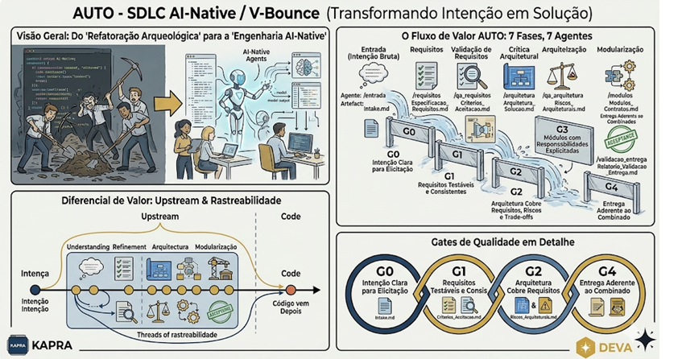
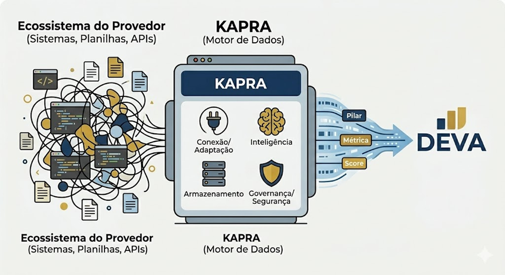
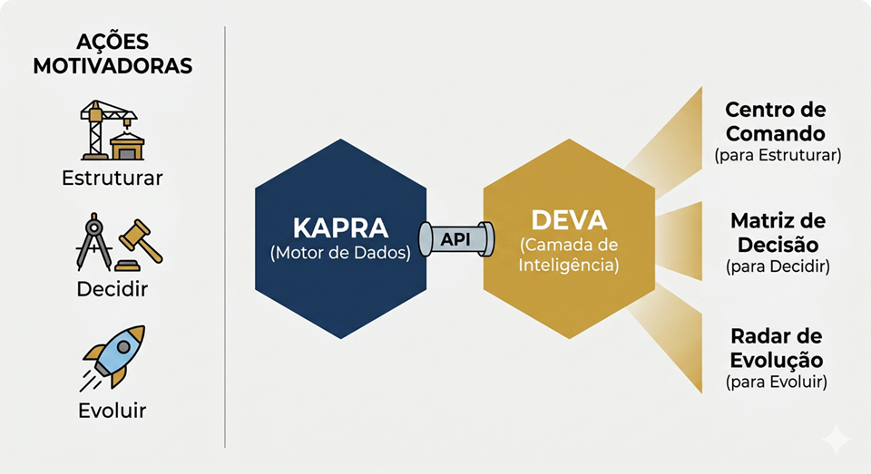
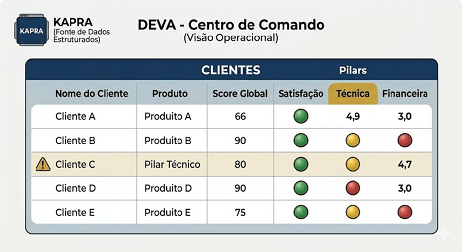
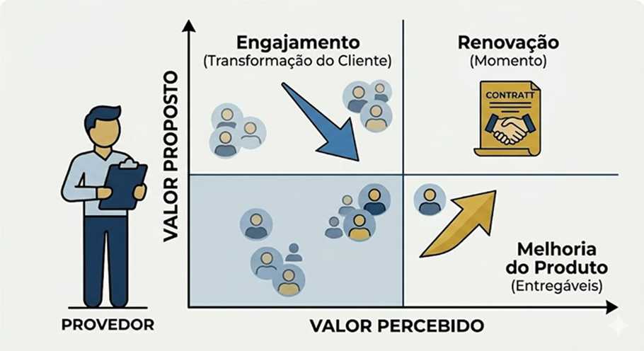
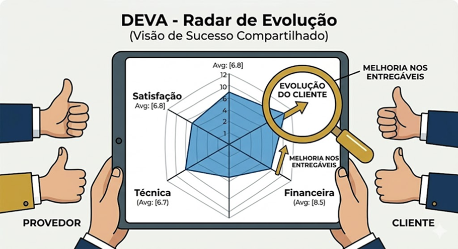
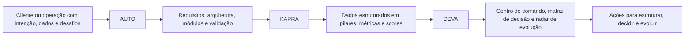
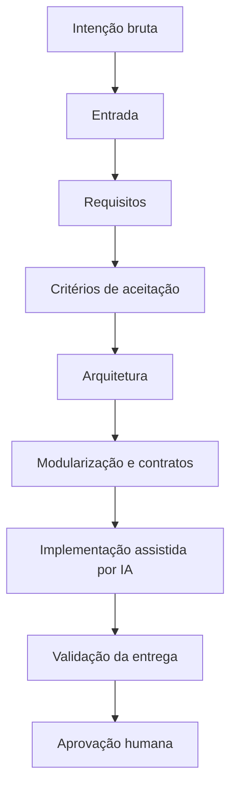

# INNOVAI — Da Intenção à Solução Validada

> Engenharia AI-native para transformar ideias, dados dispersos e decisões complexas em soluções digitais rastreáveis, testáveis e úteis no mundo real.

A **INNOVAI** combina estratégia, engenharia de software, dados e inteligência artificial para construir soluções com um ciclo estruturado de descoberta, especificação, arquitetura, implementação e validação.

Nosso diferencial está em não tratar IA como atalho para gerar código solto. Usamos IA como parceira disciplinada dentro de um processo de engenharia: primeiro clareza, depois arquitetura, então implementação. Parece óbvio. Curiosamente, é aí que muita gente tropeça.

---

## O ecossistema INNOVAI

A INNOVAI possui três soluções principais que se conectam entre si:

| Solução | Papel | Resultado esperado |
|---|---|---|
| **AUTO** | Método e fábrica AI-native de construção de apps | Transformar intenção em app validado |
| **KAPRA** | Motor de dados estruturados | Organizar dados dispersos em pilares, métricas e scores |
| **DEVA** | Camada de inteligência e decisão | Apoiar gestão, priorização e evolução do cliente |

**KAPRA** e **DEVA** são grandes soluções construídas a partir da abordagem **AUTO**: primeiro estrutura-se a intenção, depois se refinam requisitos, arquitetura, módulos e validação até chegar a uma solução consistente.

---

## AUTO — A fábrica AI-native de soluções

**AUTO** é a abordagem da INNOVAI para construir aplicações com IA de forma organizada, rastreável e validável.

Ele estrutura o ciclo de vida da solução em fases progressivas, inspiradas no V-Bounce:

1. captura da intenção;
2. refinamento de requisitos;
3. validação de critérios de aceite;
4. arquitetura;
5. modularização e contratos;
6. implementação assistida por IA;
7. validação da entrega com aprovação humana.

O objetivo do AUTO é reduzir o desperdício típico de projetos que pulam direto para código antes de entender o problema. Em vez de “vamos codar e ver no que dá”, o processo força clareza suficiente para decidir, construir e validar.

### Os 3 fundamentos do AUTO

- **Estruturação**: transforma pedidos brutos, falados ou escritos, em requisitos claros, testáveis e verificáveis.
- **Engenharia AI-native**: usa IA como parceira ao longo do ciclo de vida, não apenas como gerador de telas ou código.
- **Rastreabilidade**: mantém o rastro das decisões, da intenção inicial até o relatório de validação.

### O que o AUTO entrega

- apps e landing pages;
- fluxos operacionais internos;
- MVPs estruturados;
- features evolutivas em produtos existentes;
- documentação viva de requisitos, arquitetura, módulos e validação.

---

## KAPRA — Motor de dados estruturados

**KAPRA** é o motor de dados da INNOVAI.

Ele nasce para resolver um problema muito comum em empresas e projetos de consultoria: informações importantes estão espalhadas em planilhas, sistemas, APIs, documentos e percepções humanas. O resultado é um ecossistema cheio de dados, mas pobre em decisão.

O KAPRA conecta, adapta, organiza e governa esses dados para entregá-los em uma estrutura compreensível, utilizável e evolutiva.

### O papel do KAPRA

- conectar fontes diversas;
- padronizar informações;
- armazenar dados estruturados;
- aplicar governança e segurança;
- transformar dados em pilares, métricas e scores;
- preparar a base para camadas de inteligência como o DEVA.

Em termos práticos: o KAPRA pega o emaranhado do provedor e entrega sinal limpo para decisão. Um “detox de dados”, só que sem prometer milagre em 7 dias.

---

## DEVA — Camada de inteligência e decisão

**DEVA** é a camada de inteligência da INNOVAI para apoiar decisões de gestão, acompanhamento e evolução de clientes.

A solução utiliza dados estruturados pelo KAPRA para criar visões operacionais, matrizes de decisão, radares de evolução e centros de comando.

### O que o DEVA resolve

Muitas operações têm dados, mas não têm clareza sobre:

- quais clientes precisam de atenção;
- onde há risco de satisfação, entrega ou resultado;
- quais pilares estão evoluindo ou travando;
- quais ações devem ser priorizadas;
- como provar evolução percebida e entregue ao cliente.

O DEVA atua exatamente nesse espaço: transformar dados em leitura executiva e ação motivadora.

### Visões principais do DEVA

- **Centro de Comando**: visão operacional consolidada de clientes, scores, satisfação e pilares críticos.
- **Matriz de Decisão**: cruzamento entre valor proposto e valor percebido para orientar ações.
- **Radar de Evolução**: leitura compartilhada da evolução do cliente, conectando provedor e cliente em torno de evidências.

---

## Como AUTO, KAPRA e DEVA se conectam

A lógica é simples:

- **AUTO constrói a solução com método**;
- **KAPRA organiza a base de dados**;
- **DEVA transforma a base em inteligência operacional**.

---

## Cases em evolução

### DEVA aplicado ao Acelerador Médico

O projeto **DEVA — Acelerador Médico** aplica a camada de inteligência e decisão em um contexto de mentoria, acompanhamento e evolução de clientes.

A solução trabalha com métricas, pilares, baseline, valores reais e visão comparativa para apoiar mentor, aluno/cliente e operação na tomada de decisão.

Repositório:

- [`INNOVAI-LTDA/swaif_LTV-mentor`](https://github.com/INNOVAI-LTDA/swaif_LTV-mentor)

### AUTO aplicado à Elevve Clinic

O projeto **AUTO — Elevve Clinic** demonstra o uso do processo AI-native para criação de uma aplicação/landing page modular para uma clínica, com foco em comunicação, conversão e estruturação técnica.

A solução utiliza React, Vite, TypeScript, Tailwind e componentes modulares para organizar a experiência em seções, mantendo arquitetura clara e pronta para evolução.

Repositório:

- [`INNOVAI-LTDA/CLI_elevve_clinic`](https://github.com/INNOVAI-LTDA/CLI_elevve_clinic)

---

## Nosso modo de construção

A INNOVAI trabalha com um ciclo onde cada etapa deixa evidência:

Cada fase produz artefatos úteis, como:

- intake;
- especificação de requisitos;
- critérios de aceitação;
- arquitetura da solução;
- módulos e contratos;
- relatório de validação da entrega.

Essa estrutura permite evoluir soluções com menos ruído, menos retrabalho e mais rastreabilidade.

---

## Por que isso importa

A promessa da IA no desenvolvimento de software não é apenas escrever código mais rápido.

A promessa real é construir melhor:

- entendendo antes de implementar;
- reduzindo ambiguidade;
- usando dados com governança;
- conectando decisões a evidências;
- validando entregas contra critérios claros;
- mantendo o humano no ponto certo do processo.

A INNOVAI existe para transformar intenção em solução — com engenharia, inteligência e pragmatismo.

---

## Resumo executivo

| Solução | Frase curta |
|---|---|
| **AUTO** | Da intenção ao app validado |
| **KAPRA** | Do caos de dados à estrutura confiável |
| **DEVA** | Da estrutura à decisão e evolução |

---

## Contato

Este README foi pensado como página de apresentação institucional para GitHub, Airgo e materiais de portfólio.

Para conhecer os projetos e cases, acesse os repositórios da organização:

- https://github.com/INNOVAI-LTDA
